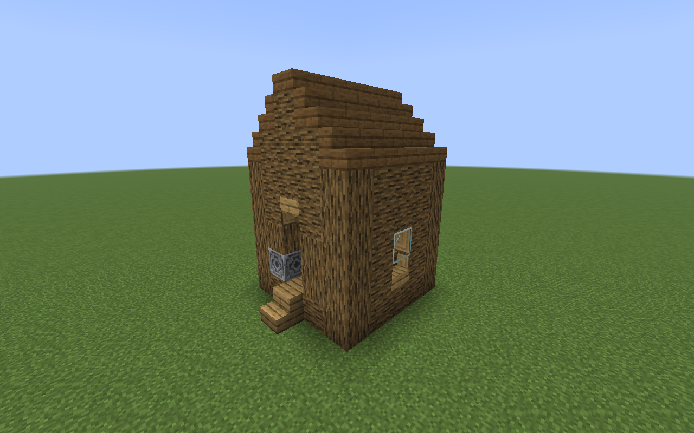
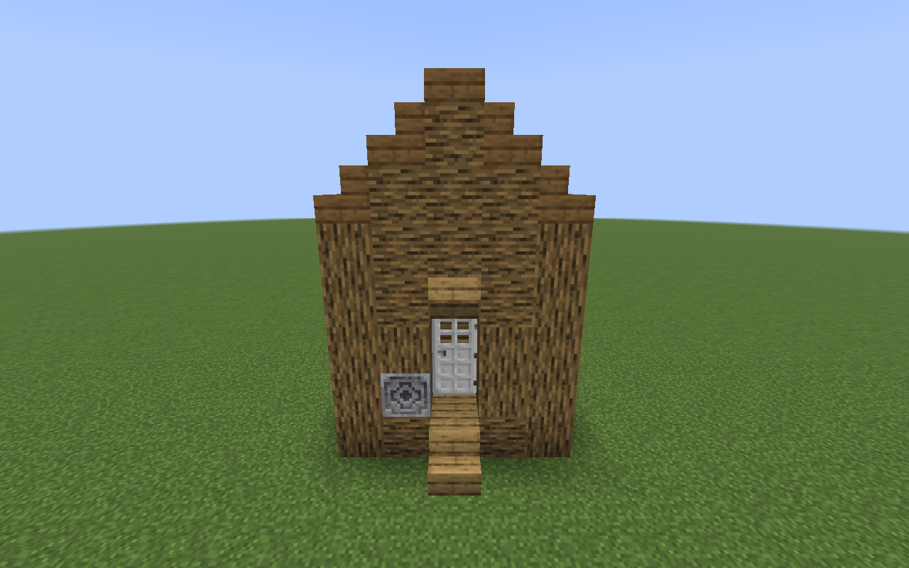
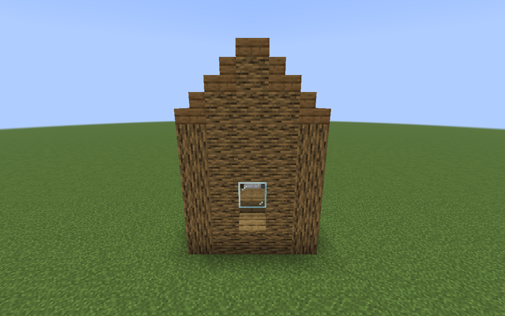
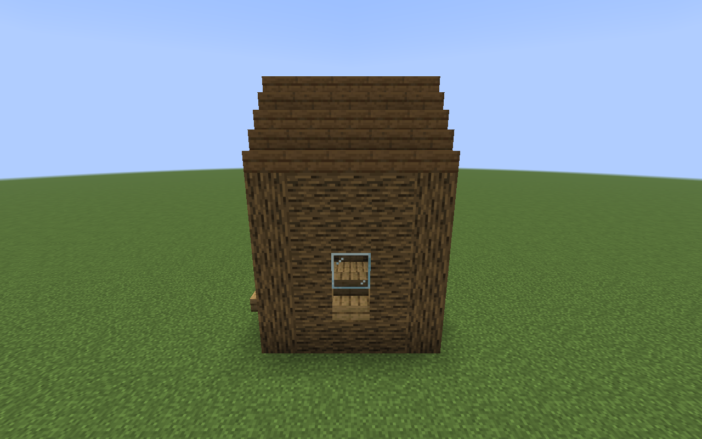
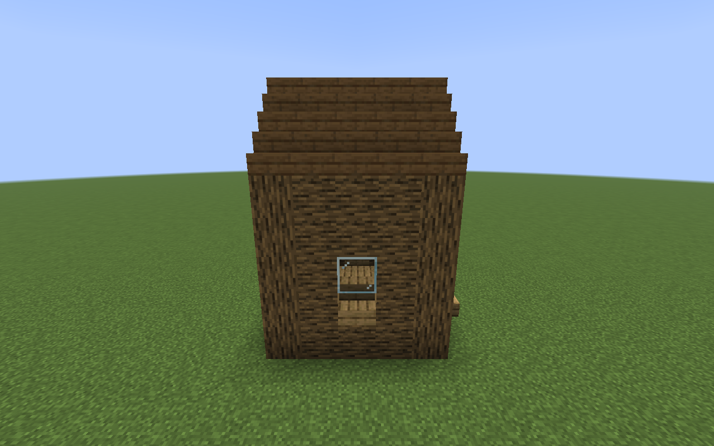

# Cabin exterior

The starter cabin keeps its 5×5 shell and original entrance step. Vertical corner posts meet horizontal log walls. Stair slopes and a slab ridge form a gable roof running front-to-back. The ridge is 1½ blocks taller than the old flat roof. The door, windows, controller, and usable interior keep their positions and space.

These Minecraft captures use oak walls, a spruce roof, and an iron door. Each cabin uses its saved palette; the redesign does not replace its chosen roof wood. Captures use noon, clear weather, and a hidden HUD. The four wall views use the same camera distance, elevation, pitch, and field of view.

## Overview

## Front

## Rear

## Left

## Right

Run `./gradlew runClientGameTest` to regenerate the captures under `build/run/clientGameTest/screenshots/`. Left and right follow the cabin's facing direction, looking outward through the entrance.

Recognizable old exteriors adopt the new structure when there is room for the taller roof. An overhead obstruction leaves the old exterior valid and intact. Packing removes either structure while preserving unrelated blocks.
